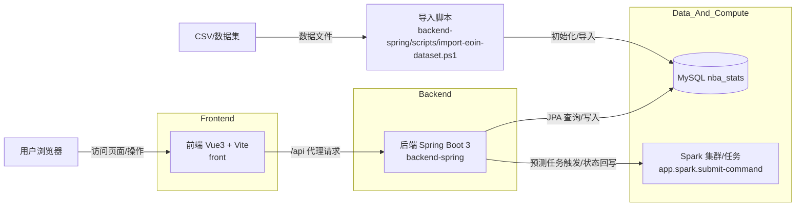

# NBA 分析项目

该工作区现已包含完整前后端实现，并支持数据库持久化与 Spark 作业接口。

## 目录说明

- front：基于 Vue3 + Vite 的前端
- backend-spring：基于 Spring Boot 的后端（JPA + MySQL + Spark API）

## 项目架构图



## 运行前提

- JDK 17+
- Maven 3.9+
- 可选：MySQL 8+

如果机器有多个 Java 版本，建议不要改系统永久环境变量，按终端会话临时切换。

## 多 Java 版本推荐用法（不改全局）

在新的 PowerShell 窗口执行：

```powershell
$env:JAVA_HOME="E:\Java\Java17"
$env:Path="$env:JAVA_HOME\bin;" + ($env:Path -replace [regex]::Escape("E:\Java\Java 8\bin;"),"")
java -version
& "D:\software\maven\apache-maven-3.9.14\bin\mvn.cmd" -v
```

也可以直接使用脚本：

```powershell
cd backend-spring
./scripts/use-java17.ps1
./scripts/run-backend.ps1 -Profile mysql
```

## 后端启动（MySQL）

```bash
mysql -u root -p < backend-spring/database/mysql_init.sql
$env:SPRING_DATASOURCE_URL="jdbc:mysql://127.0.0.1:3306/nba_stats?useSSL=false&serverTimezone=UTC&allowPublicKeyRetrieval=true"
$env:SPRING_DATASOURCE_USERNAME="root"
$env:SPRING_DATASOURCE_PASSWORD="your_password"
$env:SPRING_DATASOURCE_DRIVER_CLASS_NAME="com.mysql.cj.jdbc.Driver"
cd backend-spring
./scripts/run-backend.ps1 -Profile mysql
```

后端监听地址为 http://127.0.0.1:8080。

## 前端启动

```bash
cd front
npm install
npm run dev
```

前端开发服务器通过 Vite 代理将 /api 转发到后端。

## 一键前后端联调（推荐）

在项目根目录执行：

```powershell
./scripts/run-dev.ps1
```

说明：

- 会自动在新 PowerShell 窗口启动后端（复用 `backend-spring/scripts/run-backend.ps1`，包含 Java17 临时切换）
- 当前窗口启动前端 `npm run dev`

## 自动化自检

在完成启动后，执行：

```powershell
./scripts/verify-dev.ps1
```

如果 Vite 因端口占用切到其他地址，也可手动指定：

```powershell
./scripts/verify-dev.ps1 -FrontendUrl "http://127.0.0.1:5174/"
```

通过标准：

- 后端 `http://127.0.0.1:8080/api/dashboard/overview` 可访问，且响应包含 `code/message/data`
- 前端 `http://127.0.0.1:5173/` 可访问，且返回 HTML 页面内容

可选：查看当前后端实际连接的数据源与关键表计数：

```powershell
curl http://127.0.0.1:8080/api/admin/system/status
```

## API 协议

完整请求与响应结构定义请参见 [front/docs/API_CONTRACT.md](front/docs/API_CONTRACT.md)。

## Spark 执行配置

后端支持三种 Spark 任务模式：

- `APP_SPARK_ENABLED=false`：跳过真实执行（任务状态 `skipped`）
- `APP_SPARK_ENABLED=true` 且未设置命令：mock 成功并写入快照（便于联调）
- `APP_SPARK_ENABLED=true` 且设置命令：执行真实 Spark 命令并记录输出

示例：

```powershell
$env:APP_SPARK_ENABLED="true"
$env:APP_SPARK_SUBMIT_COMMAND="spark-submit --master local[*] scripts/spark_daily_job.py"
$env:APP_SPARK_WORKING_DIR="D:\software\nba_analysis_project\backend-spring"
$env:APP_SPARK_TIMEOUT_SECONDS="1800"
cd backend-spring
./scripts/run-backend.ps1 -Profile mysql
```

## 真实数据导入（推荐数据源 #1）

请确保数据目录至少包含 `PlayerStatistics.csv`，推荐同时包含 `Games.csv` 以导入比赛历史。

在 `backend-spring` 目录执行：

```powershell
./scripts/import-eoin-dataset.ps1 -DatasetDir "D:\software\nba_analysis_project\data" -ApplyToMySql -MySqlUser root -MySqlPassword your_password
```

不传 `-DatasetDir` 时，脚本默认读取 `D:\software\nba_analysis_project\data`。

导入完成后，可用状态接口确认当前库与数据量：

```powershell
curl http://127.0.0.1:8080/api/admin/system/status
```

## 常见问题

1. `mvn -v` 显示 Java 8：
	说明当前终端没有切到 Java17，请先执行上面的临时切换命令或 `./scripts/use-java17.ps1`。

2. `help:effective-settings` 报 Unknown lifecycle phase `.xml`：
	PowerShell 里请确保参数不被拆分，推荐写法：

```powershell
& "D:\software\maven\apache-maven-3.9.14\bin\mvn.cmd" help:effective-settings "-Doutput=effective-settings.xml"
```

## 快速验证清单

1. 启动完成后先运行 `./scripts/verify-dev.ps1`，确认基础链路正常。
2. 启动前端后访问开发地址（通常是 `http://127.0.0.1:5173`），首页可正常打开。
3. 进入“球员分析”，搜索任意球员并打开详情页。
4. 进入“球队对比”，选择两支球队后能看到图表与指标对比。
5. 进入“预测中心”，分别触发球员预测、比赛预测、赛季趋势与解释性视图。
6. 进入“数据管理”，尝试上传 CSV 并确认历史记录列表刷新。
