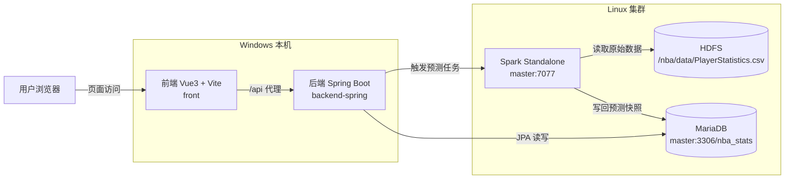

# 启动说明（3 节点 Spark 集群 + MariaDB）

本文档面向以下部署形态：

- Windows 本机：运行前端（Vue）与后端（Spring Boot）
- Linux 集群：运行 Hadoop/HDFS、Spark Standalone、MariaDB（在 master 节点）
- 数据源：Eoin NBA 数据集已导入 MariaDB，统计文件已上传 HDFS

---

## 架构图（集群部署）



---

## 1. 环境前置条件

### 1.1 Windows 本机

- Node.js + npm（用于前端）
- Maven（用于后端）
- JDK 17（用于后端编译与运行）
- hosts 解析：确保 Windows 能解析 `master` 主机名（或直接使用 master 的 IP）

后端代码使用了 `record` 与 Java 文本块（`"""`），必须使用 JDK 17 编译运行，否则会出现“需要 class/interface/enum”“未结束的字符串文字”等编译错误。

### 1.2 Linux 集群（master + workers）

- Hadoop/HDFS 正常运行
- Spark Standalone 正常运行（master 监听 `7077`）
- Python3 + numpy 在所有节点安装完成（执行 PySpark ML 必需）
- MariaDB 在 `master` 节点运行并允许来自集群内的连接
- MySQL JDBC 驱动已放在 `master` 节点：`/home/hadoop/mysql-connector-java-8.0.30.jar`

---

## 2. 数据准备检查

### 2.1 HDFS 数据文件

在 `master` 节点执行，确认文件存在：

```bash
hadoop fs -ls /nba/data/PlayerStatistics.csv
```

### 2.2 MariaDB 数据库

在 Navicat 或 MariaDB 命令行验证：

```sql
SELECT COUNT(*) FROM nba_stats.players;
SELECT COUNT(*) FROM nba_stats.games;
SELECT COUNT(*) FROM nba_stats.prediction_snapshot;
```

---

## 3. 启动后端（Windows）

### 3.1 配置数据库连接

后端配置文件：

- [application.yml](file:///d:/Software/nba_analysis_project/backend-spring/src/main/resources/application.yml)

确保 `spring.datasource.url` 指向 `master:3306/nba_stats`（或使用 IP）。

### 3.2 使用 JDK 17 启动

推荐在 `backend-spring` 目录执行：

```powershell
mvn -v
java -version
mvn spring-boot:run
```

如果 `mvn -v` 显示的 Java 不是 17，请先设置 `JAVA_HOME` 指向 JDK 17，然后再运行。

后端默认端口：`http://localhost:8080`

---

## 4. 启动前端（Windows）

在 `front` 目录执行：

```powershell
npm install
npm run dev
```

前端默认地址：`http://localhost:5173`

---

## 5. 运行 Spark 预测任务（Linux master）

### 5.1 前置检查

确认 JDBC 驱动存在：

```bash
ls -l /home/hadoop/mysql-connector-java-8.0.30.jar
```

### 5.2 提交任务

在 `master` 节点执行（脚本路径以你的实际放置位置为准）：

```bash
spark-submit \
  --master spark://master:7077 \
  --jars /home/hadoop/mysql-connector-java-8.0.30.jar \
  --conf "spark.pyspark.python=python3" \
  --conf "spark.pyspark.driver.python=python3" \
  /home/hadoop/spark_nba_ml.py
```

Spark UI（任务运行期间可用）：`http://master:4040`

### 5.3 验证写回结果

在 Navicat 执行：

```sql
SELECT COUNT(*) FROM nba_stats.prediction_snapshot;
SELECT * FROM nba_stats.prediction_snapshot ORDER BY created_at DESC LIMIT 10;
```

---

## 6. 常见问题

### 6.1 后端编译报 “需要 class/interface/enum”

原因：使用了较低版本 Java 编译（非 JDK 17）。

处理：确认 `mvn -v` 的 Java 版本为 17。

### 6.2 Spark 报 numpy 缺失

原因：集群节点缺少 `numpy`。

处理：在 master 与所有 worker 节点安装 `python3` 与 `numpy`。

### 6.3 Spark 写 MariaDB 报 Access denied

原因：MariaDB 用户权限未覆盖 `root@master` 或 `root@%`。

处理：在 MariaDB 执行针对主机名/IP 的授权并 `FLUSH PRIVILEGES`。

